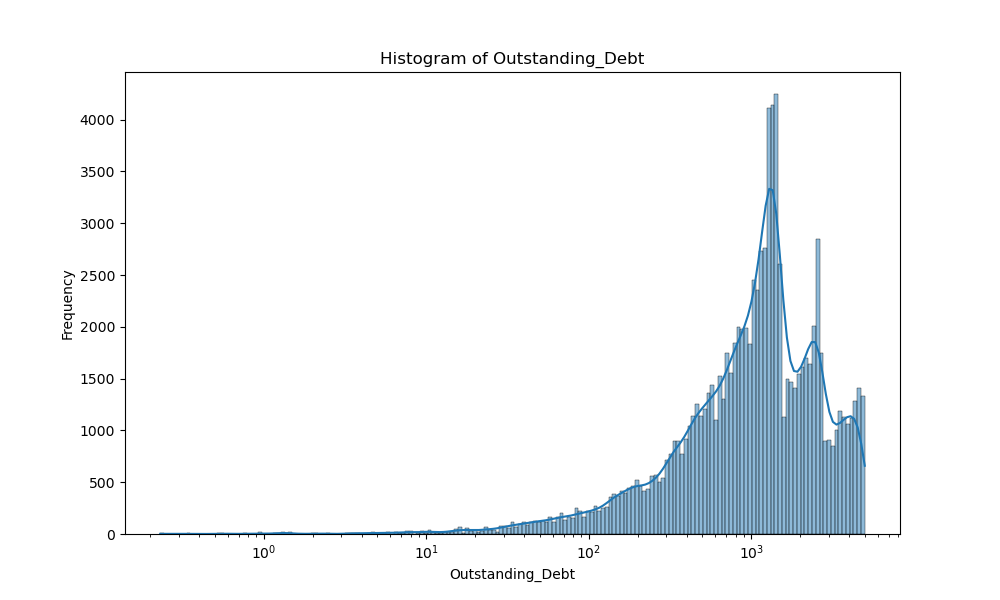
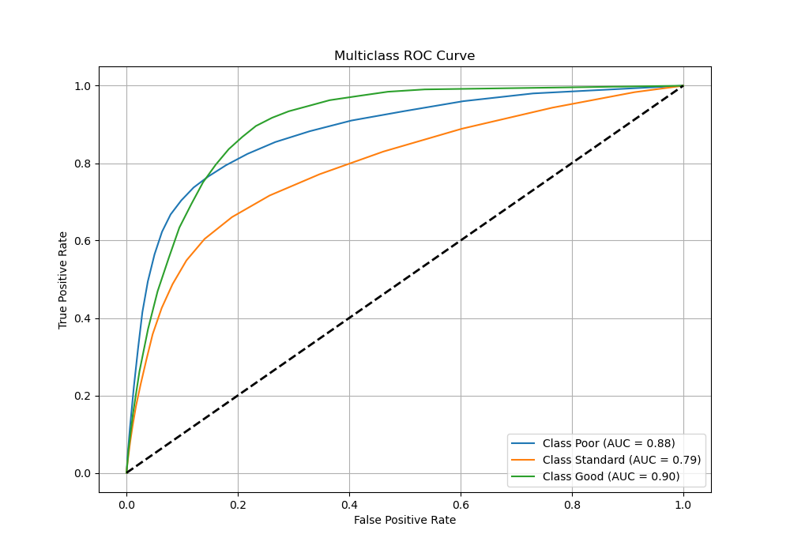

# Credit Score Prediction Project

## Overview
This project involves building a machine learning pipeline to predict credit scores for customers using a dataset that includes features such as demographic information, income, loan details, and payment behaviors. The pipeline includes data cleaning, preprocessing, feature engineering, clustering, and classification using k-Nearest Neighbors (k-NN). Hyperparameter tuning and model evaluation are also performed to ensure optimal performance.

## Problem Statement
The objective is to categorize individuals into predefined credit score categories based on financial and demographic information.

## Data
The data consists of multiple rows per customer ID, representing different months. The dataset contains a mix of numerical and categorical features with missing values and anomalies. The data cleaning and preprocessing steps are critical for handling these challenges. There are 26 features originally.

### Numerical Features
The following numerical features are included in the dataset and are used for model training and evaluation:

- **Monthly_Inhand_Salary**: The monthly income in hand after deductions.
- **Num_Bank_Accounts**: The number of bank accounts held by the customer.
- **Num_Credit_Card**: The number of credit cards owned by the customer.
- **Interest_Rate**: The interest rate on loans or credit.
- **Delay_from_due_date**: The delay in payments beyond the due date (in days).
- **Num_Credit_Inquiries**: The number of inquiries made for credit applications.
- **Credit_Utilization_Ratio**: The ratio of utilized credit to total credit available.
- **Total_EMI_per_month**: The total EMI payments made per month.

### Categorical Features
The dataset also includes the following categorical features:

- **ID**: A unique identifier for each transaction/record.
- **Customer_ID**: A unique identifier for each customer.
- **Month**: The month associated with the record.
- **Name**: The name of the customer.
- **Age**: The age of the customer.
- **SSN**: The Social Security Number of the customer.
- **Occupation**: The customer’s occupation.
- **Annual_Income**: The annual income of the customer.
- **Num_of_Loan**: The total number of loans taken by the customer.
- **Type_of_Loan**: The types of loans taken (e.g., home, personal, car).
- **Num_of_Delayed_Payment**: The number of delayed payments by the customer.
- **Changed_Credit_Limit**: The amount by which the credit limit has changed.
- **Credit_Mix**: The mix of credit types used by the customer (e.g., secured, unsecured).
- **Outstanding_Debt**: The total outstanding debt of the customer.
- **Credit_History_Age**: The duration of the customer’s credit history.
- **Payment_of_Min_Amount**: Indicates whether the customer pays the minimum amount due.
- **Amount_invested_monthly**: The monthly amount invested by the customer.
- **Payment_Behaviour**: The customer's payment behavior (e.g., consistent, delayed).
- **Monthly_Balance**: The balance remaining at the end of the month.
- **Credit_Score**: The target variable indicating the creditworthiness of the customer (e.g., Poor, Standard, Good).

## Workflow

### Data Preprocessing
1. **Handling Missing Values in Numerical Data:**
   - The dataset contains missing and irrelevant values that are addressed systematically. 
   - Garbage values, such as special characters or placeholders like 23_ and 10000_, are first converted to NaN. 
   - Numerical columns with invalid entries, such as negative or zero values for Age or excessively high numbers for Num_Bank_Accounts, are also replaced with NaN. 
   - Since the dataset includes 8 rows for each Customer_ID, instead of dropping rows with missing values, the data is grouped by Customer_ID. 
   - Missing or irrelevant values are then imputed using the mode of each group for categorical features or forward and backward filling for numerical features. 
   - This approach ensures that missing values are filled in a way that preserves customer-specific and temporal patterns without 50 percent data loss.

2. **Categorical Cleaning and Encoding:**
    - **Imputation of Missing or Invalid Entries:** Missing or invalid entries in columns like `Occupation` and `Payment_Behaviour` are replaced using group-based mode imputation or forward/backward filling. For example, invalid entries such as `_______` in the `Occupation` column or `!@9#%8` in `Payment_Behaviour` are replaced with meaningful placeholders like `Unknown`.  
    - **Encoding:**  
     - Label encoding is used for ordinal categorical features where the categories have a meaningful order, such as `Credit_Mix` (e.g., `Good`, `Standard`, `Bad`) and `Payment_of_Min_Amount` (e.g., `Yes`, `No`, `NM`), which are mapped to numerical values based on their significance.  
     - One-hot encoding is applied to nominal categorical features such as `Payment_Behaviour`, which we assumed, does not have a natural order. This encoding expands the feature space by creating binary columns for each unique category, allowing the model to treat each category independently.  
    - **Preprocessing of High-Cardinality Features:** For columns like `Type_of_Loan` that contain multiple values separated by commas, the data is split into individual rows or columns before applying encoding. This ensures better representation and avoids inflating the feature space unnecessarily.

### Exploratory Data Analysis (EDA)
1. **Visualization of Feature Distributions**
   - **Histograms:** Histograms were created to show the distributions of significant numerical features. Normal histograms were plotted at first, but log-log scales were used for better representation because of the skewness in the data.
   
   Outstanding Debt Histogram:
      - The distribution is highly right-skewed, necessitating a log scale for better visualization
      - Multiple peaks are visible, suggesting distinct debt brackets or lending patterns
      - Highest frequency occurs around 1000-2000 range
      - Long tail extends to higher debt values, indicating fewer cases of very high debt
      - Clear multimodal distribution suggests different types of loans or borrower segments

   -**Box plots:** Box plots were created to identify outliers and understand the spread of each feature.
   
   From Box plot above, Delay from Due Date Boxplot
      - The median delay is approximately 18 days
      - There is significant spread in delays, ranging from 0 to about 55 days
      - Multiple outliers appear above 60 days, indicating some extreme cases of payment delays
      - The distribution is slightly skewed upward, suggesting more cases of longer delays than shorter ones

   
   Number of Delayed Payments Boxplot
      - Extreme outliers are present, with some cases showing over 4000 delayed payments
      - The median appears to be close to zero, suggesting most customers have few delayed payments
      - Very compressed box indicates that the majority of customers fall within a narrow range
      - The distribution is heavily skewed by outliers, which could represent problematic accounts

   -**Scatter plots:** Scatter plots were used to visualize individual features against their indices to detect any anomalies or patterns.
   
2. **Correlation Analysis:** A correlation matrix was computed to identify relationships between numerical variables such as income, debt, and delayed payments. Only strong correlations (specified threshold of 0.1 as given) were visualized using a heatmap.
   

   - **Strong Positive Correlations**
   Annual Income and Monthly Inhand Salary show perfect correlation (1.0), indicating they are directly proportional
      - Outstanding Debt and Number of Loans share a moderate positive correlation (~0.58)
      - Credit History Age and Payment of Minimum Amount show positive correlation (~0.55)
   - **Strong Negative Correlations**
   Interest Rate shows negative correlations with multiple variables:
      - Age (-0.31)
      - Monthly Balance (-0.25)
      - Bank Accounts (-0.40)
   - **Key Observatiions:**
      - Auto, personal, student, and home equity loans all exhibit comparable correlation patterns with one another.
      - The correlation between the Credit Utilization Ratio and the Credit Mix and the majority of variables is comparatively weak.
      - The majority of financial variables exhibit moderately negative correlations with age, indicating that younger individuals may exhibit distinct financial patterns.
      - The strong correlation between Annual Income and Monthly Inhand Salary suggests one of these variables might be redundant for modeling
      - Several loan-related variables show similar correlation patterns, indicating possible redundancy in loan-type features

### Feature Engineering, Scaling and Selection
1. **Feature Engineering:**
   - Columns such as `Credit_History_Age` are converted from years and months to only months for numerical analysis.
   - Numerical anomalies (e.g., negative values in `Delay_from_due_date`) are corrected or removed..

2. **Feature Scaling:**
   - Numerical features in the dataset are scaled using a combination of `RobustScaler` and `StandardScaler` to ensure effective preprocessing. Columns prone to outliers and skewness, such as `Total_EMI_per_month` and `Monthly_Balance`, are scaled using `RobustScaler`, which centers the data by the median. These financial features often exhibit significant variability, with extreme values skewing the distribution. For instance, while most individuals may have an EMI of $1,000 to $5,000, a few outliers with EMIs exceeding $50,000 could disproportionately influence scaling methods like Min-Max or Z-score scaling. The Robust Scaler, by centering the data around the median and scaling it using the interquartile range (IQR), ensures that the model focuses on the central data distribution rather than being overly influenced by outliers. For example, applying this scaler on `Annual_Income` mitigates the impact of a high-income earner earning $500,000, allowing the data to retain meaningful variations for the majority of observations. This preprocessing step enhances the robustness of downstream machine learning models and statistical analyses. This approach minimizes the impact of extreme values while retaining valuable data patterns. Other numerical features are scaled using `StandardScaler` to ensure they follow a standard normal distribution (mean = 0, standard deviation = 1).

    - To apply these scalers efficiently, a `ColumnTransformer` is utilized, allowing different scaling techniques to be applied to specific subsets of features in a single step. Some features in the dataset were highly skewed, which likely contributed to poor silhouette scores during clustering. However, applying `RobustScaler` to these columns proved to be a game-changer, significantly improving the clustering performance and enhancing the overall pipeline.

3. **Feature Selection:**
   - Irrelevant columns like `ID`, `Customer_ID`, and `Name` are dropped.
   - Duplicate rows are removed.
   - The total feature space after encoding is 51 which is not too high and all the features are important for our model. As a result, we did not apply any further dimentionally reduction strategies.

4. **Target Encoding:**
   - The target variable `Credit_Score` is mapped to numerical values: `Poor` (0), `Standard` (1), and `Good` (2).

### Clustering
1. **k-Means Clustering:**
   - k-Means is applied to identify clusters within the data. This step helps in understanding the grouping of customers based on their features. The Silhouette Score is 0.95.

   **Visualization:**
   - PCA is applied to reduce the data dimensions to 2D or 3D for clustering visualization.

      

   - The PCA clustering visualization demonstrates that the data effectively separates into three distinct clusters (Cluster 0, Cluster 1, Cluster 2) when projected onto two principal components. 
   - These clusters align with the three credit score categories: Good, Standard, and Poor, indicating that the inherent grouping patterns in the data are closely related to the target variable. 
   - The clear separation of clusters suggests that the preprocessing and clustering steps, such as scaling and dimensionality reduction, were successful. 
   - This validates the clustering algorithm’s ability to capture meaningful distinctions between credit score categories, providing actionable insights for customer segmentation.

2. **Heirarchical Clustering:**
   - This is used as an alternative clustering method. The Silhouette Score is 0.95.
   **Visualization:**
   - PCA is applied to reduce the data dimensions to 2D or 3D for clustering visualization.

### Classification

1. **Model Selection:**
   - k-Nearest Neighbors (k-NN) is used for classification due to its simplicity and minimal hyperparameter requirements.
   - The Random Forest classifier was chosen for its ability to handle high-dimensional data, and effectiveness in capturing complex patterns through ensemble learning.

2. **Model Training:**
   - The dataset is split into training (80%) and testing (20%) sets.
   - Cross-validation is performed with 5 folds to evaluate model consistency.
   - **KNN**  
         Cross-Validation Scores: [0.67934062 0.67433047 0.67578322 0.67540424 0.68064679]
   - **Random Forest**
         Cross-Validation Scores: [0.81595402 0.81360536 0.80773118 0.81171046 0.81246842]
   - The cross-validation scores demonstrate consistent performance across folds, with an average accuracy of approximately 81.6%, indicating reliable generalization. 

3. **Evaluation Metrics:**
      - **KNN**
         - **Accuracy**: 0.6811  
         - **Precision**: 0.6798  
         - **Recall**: 0.6811  
         - **F1-Score**: 0.6781  
         - **AUC-ROC**: 0.8156 

      - **Random Forest**
         - **Accuracy**: 0.8161  
         - **Precision**: 0.8165  
         - **Recall**: 0.8160  
         - **F1-Score**: 0.8159  
         - **AUC-ROC**: 0.9140 
- The model achieved an accuracy of 81.6%, with precision, recall, and F1-scores closely aligned, reflecting balanced performance. The high AUC-ROC of 91.4% indicates excellent discrimination capability between classes.  
    
    

    The confusion matrix for the k-Nearest Neighbors (k-NN) model reveals that the classifier performs well for classifying samples in class 1, with 8124 correctly predicted, indicating strong performance for this majority class. However, there are notable misclassifications for classes 0 and 2, which are often misclassified as class 1 (e.g., 1851 samples from class 0 and 1602 from class 2 were predicted as class 1). This suggests that the model struggles to distinguish between these classes, potentially due to overlapping feature distributions or class imbalance in the dataset. While k-NN effectively identifies the dominant patterns in class 1, the confusion in distinguishing 0 and 2 highlights the need for better feature representation, scaling adjustments, or potential weighting strategies to improve the model's performance for minority or less distinct classes.

    

    The Multiclass ROC curve provides an evaluation of the k-Nearest Neighbors (k-NN) model's performance for each credit score category: Poor, Standard, and Good. The AUC values for each class indicate the model's ability to distinguish that class from the others. The curve shows that the model performs best for the Good class with an AUC of 0.88, followed by the Poor class with an AUC of 0.85, while the Standard class has the lowest AUC of 0.78. This suggests that the model is more effective at identifying customers with "Good" or "Poor" credit scores compared to "Standard." The "Standard" class overlaps more with the others, as indicated by its relatively lower AUC. The overall trend of the ROC curves and the high AUC values for "Good" and "Poor" indicate that the k-NN model captures distinctions in these classes well, though improvements are needed to enhance its performance for the "Standard" class.

### Hyperparameter Tuning
1. **Grid Search:**
   - Hyperparameters for k-NN, such as `n_neighbors` and `weights`, are tuned using Grid Search to identify the optimal configuration.

2. **Results:**
   - The best parameters are printed along with the performance metrics for the optimal model.  
   Best Parameters: {'n_neighbors': 10, 'weights': 'distance'}

## Key Functions
1. **Data Cleaning:**
   - `filter_numeric_data`: Cleans numeric features with invalid or anomalous values.
   - `label_encoding`: Encodes categorical features into numerical format.
   - `one_hot_encode`: Performs one-hot encoding for categorical features.

2. **Clustering:**
   - `apply_kmeans`: Applies k-Means clustering and returns cluster labels.
   - `perform_dbscan`: Performs DBSCAN clustering.
   - `perform_pca`: Reduces data dimensions using PCA.
   - `perform_tsne`: Reduces data dimensions using t-SNE.

3. **Classification:**
   - `split_dataset`: Splits the data into training and testing sets.
   - `evaluate_model`: Calculates performance metrics (Accuracy, Precision, Recall, F1-Score, AUC-ROC).
   - `perform_cross_validation`: Performs cross-validation for model consistency.
   - `perform_grid_search`: Performs hyperparameter tuning using Grid Search.

4. **Visualization:**
   - `plot_confusion_matrix`: Visualizes confusion matrices.
   - `plot_roc_curve`: Plots ROC curves.
   - `plot_pca_clusters_2D`: Visualizes PCA clusters in 2D.
   - `plot_pca_clusters_3D`: Visualizes PCA clusters in 3D.

## Conclusion
This pipeline automates the prediction of credit scores by preprocessing raw customer data, applying clustering, and building a classification model. With robust cleaning and preprocessing steps, combined with advanced visualization and tuning techniques, this system provides actionable insights into customer creditworthiness.
