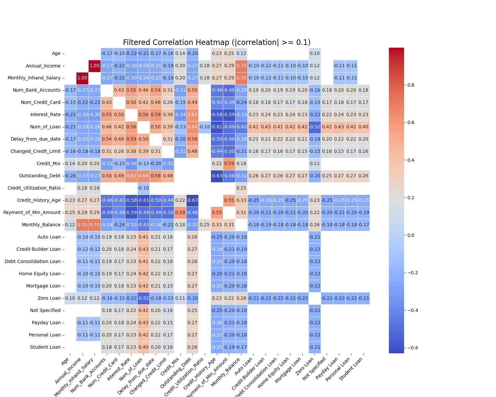

# Credit Score Prediction Project

## Overview

The Credit Score Prediction Project highlights the implementation of a machine learning pipeline to predict credit scores for customers using a structured dataset. The pipeline incorporates comprehensive data cleaning, preprocessing, feature engineering, clustering, and classification, emphasizing hyperparameter tuning and model evaluation. It aims to transform raw financial and demographic data into actionable insights, aiding stakeholders in assessing creditworthiness efficiently.

---

## Problem Definition

The project addresses the challenge of categorizing individuals into predefined credit score categories (‘Poor,’ ‘Standard,’ ‘Good’) based on their financial and demographic profiles. This involves handling a dataset with missing values, anomalies, and diverse feature types, requiring a robust pipeline to preprocess, augment, and analyze data effectively. The goal is to develop a predictive model that achieves high accuracy while providing interpretable results for stakeholders, ensuring fair and effective credit score assessments.

---
## Data
The data consists of multiple rows per customer ID, representing different months. The dataset contains a mix of numerical and categorical features with missing values and anomalies. The data cleaning and preprocessing steps are critical for handling these challenges. There are 26 features originally.

### Numerical Features
The following numerical features are included in the dataset and are used for model training and evaluation:

- **Monthly_Inhand_Salary**: The monthly income in hand after deductions.
- **Num_Bank_Accounts**: The number of bank accounts held by the customer.
- **Num_Credit_Card**: The number of credit cards owned by the customer.
- **Interest_Rate**: The interest rate on loans or credit.
- **Delay_from_due_date**: The delay in payments beyond the due date (in days).
- **Num_Credit_Inquiries**: The number of inquiries made for credit applications.
- **Credit_Utilization_Ratio**: The ratio of utilized credit to total credit available.
- **Total_EMI_per_month**: The total EMI payments made per month.

### Categorical Features
The dataset also includes the following categorical features:

- **ID**: A unique identifier for each transaction/record.
- **Customer_ID**: A unique identifier for each customer.
- **Month**: The month associated with the record.
- **Name**: The name of the customer.
- **Age**: The age of the customer.
- **SSN**: The Social Security Number of the customer.
- **Occupation**: The customer’s occupation.
- **Annual_Income**: The annual income of the customer.
- **Num_of_Loan**: The total number of loans taken by the customer.
- **Type_of_Loan**: The types of loans taken (e.g., home, personal, car).
- **Num_of_Delayed_Payment**: The number of delayed payments by the customer.
- **Changed_Credit_Limit**: The amount by which the credit limit has changed.
- **Credit_Mix**: The mix of credit types used by the customer (e.g., secured, unsecured).
- **Outstanding_Debt**: The total outstanding debt of the customer.
- **Credit_History_Age**: The duration of the customer’s credit history.
- **Payment_of_Min_Amount**: Indicates whether the customer pays the minimum amount due.
- **Amount_invested_monthly**: The monthly amount invested by the customer.
- **Payment_Behaviour**: The customer's payment behavior (e.g., consistent, delayed).
- **Monthly_Balance**: The balance remaining at the end of the month.
- **Credit_Score**: The target variable indicating the creditworthiness of the customer (e.g., Poor, Standard, Good).

## Workflow

### Data Preprocessing
1. **Handling Missing Values in Numerical Data:**
   - The dataset contains missing and irrelevant values that are addressed systematically. 
   - Garbage values, such as special characters or placeholders like 23_ and 10000_, are first converted to NaN. 
   - Numerical columns with invalid entries, such as negative or zero values for Age or excessively high numbers for Num_Bank_Accounts, are also replaced with NaN. 
   - Since the dataset includes 8 rows for each Customer_ID, instead of dropping rows with missing values, the data is grouped by Customer_ID. 
   - Missing or irrelevant values are then imputed using the mode of each group for categorical features or forward and backward filling for numerical features. 
   - This approach ensures that missing values are filled in a way that preserves customer-specific and temporal patterns without 50 percent data loss.

2. **Categorical Cleaning and Encoding:**
    - **Imputation of Missing or Invalid Entries:** Missing or invalid entries in columns like `Occupation` and `Payment_Behaviour` are replaced using group-based mode imputation or forward/backward filling. For example, invalid entries such as `_______` in the `Occupation` column or `!@9#%8` in `Payment_Behaviour` are replaced with meaningful placeholders like `Unknown`.  
    - **Encoding:**  
     - Label encoding is used for ordinal categorical features where the categories have a meaningful order, such as `Credit_Mix` (e.g., `Good`, `Standard`, `Bad`) and `Payment_of_Min_Amount` (e.g., `Yes`, `No`, `NM`), which are mapped to numerical values based on their significance.  
     - One-hot encoding is applied to nominal categorical features such as `Payment_Behaviour`, which we assumed, does not have a natural order. This encoding expands the feature space by creating binary columns for each unique category, allowing the model to treat each category independently.  
    - **Preprocessing of High-Cardinality Features:** For columns like `Type_of_Loan` that contain multiple values separated by commas, the data is split into individual rows or columns before applying encoding. This ensures better representation and avoids inflating the feature space unnecessarily.

3. **Data Augmentation:**
- We used SMOTE (Synthetic Minority Oversampling Technique) to handle class imbalance by generating synthetic samples for the minority class.
- **How It Works**:
  1. Identifies k-nearest neighbors for minority class samples.
  2. Creates new synthetic samples by interpolating between a sample and its neighbors.
- **Impact**: Balances the dataset, ensuring the model doesn't become biased toward the majority class and improving predictive performance.

4. **Dimensionality Reduction:**  
   - We only had 51 features after all the encodings for approx 100k entries which are not very high in number so we did not perform any dimensionality reduction on the dataset itself. However, we did experiment with considering on ly the top features using methods like RFE (explained lated in the report). We used PCA only for visualization purposes (as shown in the following sections).

### Exploratory Data Analysis (EDA)
1. **Visualization of Feature Distributions**
   - **Histograms:** Histograms were created to show the distributions of significant numerical features. Normal histograms were plotted at first, but log-log scales were used for better representation because of the skewness in the data.
     
   Outstanding Debt Histogram:  
      - The distribution is highly right-skewed, necessitating a log scale for better visualization
      - Multiple peaks are visible, suggesting distinct debt brackets or lending patterns
      - Highest frequency occurs around 1000-2000 range
      - Long tail extends to higher debt values, indicating fewer cases of very high debt
      - Clear multimodal distribution suggests different types of loans or borrower segments  

   -**Box plots:** Box plots were created to identify outliers and understand the spread of each feature.  
     
   From Box plot above, Delay from Due Date Boxplot
      - The median delay is approximately 18 days
      - There is significant spread in delays, ranging from 0 to about 55 days
      - Multiple outliers appear above 60 days, indicating some extreme cases of payment delays
      - The distribution is slightly skewed upward, suggesting more cases of longer delays than shorter ones  

     
   Number of Delayed Payments Boxplot  
      - Extreme outliers are present, with some cases showing over 4000 delayed payments
      - The median appears to be close to zero, suggesting most customers have few delayed payments
      - Very compressed box indicates that the majority of customers fall within a narrow range
      - The distribution is heavily skewed by outliers, which could represent problematic accounts  

   -**Scatter plots:** Scatter plots were used to visualize individual features against their indices to detect any anomalies or patterns.  
   
2. **Correlation Analysis:** A correlation matrix was computed to identify relationships between numerical variables such as income, debt, and delayed payments. Only strong correlations (specified threshold of 0.1 as given) were visualized using a heatmap.  
     

   **Strong Positive Correlations**  
   Annual Income and Monthly Inhand Salary show perfect correlation (1.0), indicating they are directly proportional
      - Outstanding Debt and Number of Loans share a moderate positive correlation (~0.58)
      - Credit History Age and Payment of Minimum Amount show positive correlation (~0.55)  
   **Strong Negative Correlations**
   Interest Rate shows negative correlations with multiple variables:
      - Age (-0.31)
      - Monthly Balance (-0.25)
      - Bank Accounts (-0.40)  
   **Key Observatiions:**  
      - Auto, personal, student, and home equity loans all exhibit comparable correlation patterns with one another.
      - The correlation between the Credit Utilization Ratio and the Credit Mix and the majority of variables is comparatively weak.
      - The majority of financial variables exhibit moderately negative correlations with age, indicating that younger individuals may exhibit distinct financial patterns.
      - The strong correlation between Annual Income and Monthly Inhand Salary suggests one of these variables might be redundant for modeling
      - Several loan-related variables show similar correlation patterns, indicating possible redundancy in loan-type features

### Feature Engineering, Scaling and Selection
1. **Feature Engineering:**
   - Columns such as `Credit_History_Age` are converted from years and months to only months for numerical analysis.
   - Numerical anomalies (e.g., negative values in `Delay_from_due_date`) are corrected or removed..

2. **Feature Scaling:**
   - Numerical features in the dataset are scaled using a combination of `RobustScaler` and `StandardScaler` to ensure effective preprocessing. Columns prone to outliers and skewness, such as `Total_EMI_per_month` and `Monthly_Balance`, are scaled using `RobustScaler`, which centers the data by the median. These financial features often exhibit significant variability, with extreme values skewing the distribution. For instance, while most individuals may have an EMI of $1,000 to $5,000, a few outliers with EMIs exceeding $50,000 could disproportionately influence scaling methods like Min-Max or Z-score scaling. The Robust Scaler, by centering the data around the median and scaling it using the interquartile range (IQR), ensures that the model focuses on the central data distribution rather than being overly influenced by outliers. For example, applying this scaler on `Annual_Income` mitigates the impact of a high-income earner earning $500,000, allowing the data to retain meaningful variations for the majority of observations. This preprocessing step enhances the robustness of downstream machine learning models and statistical analyses. This approach minimizes the impact of extreme values while retaining valuable data patterns. Other numerical features are scaled using `StandardScaler` to ensure they follow a standard normal distribution (mean = 0, standard deviation = 1).

    - To apply these scalers efficiently, a `ColumnTransformer` is utilized, allowing different scaling techniques to be applied to specific subsets of features in a single step. Some features in the dataset were highly skewed, which likely contributed to poor silhouette scores during clustering. However, applying `RobustScaler` to these columns proved to be a game-changer, significantly improving the clustering performance and enhancing the overall pipeline.

3. **Feature Selection:**
   - Irrelevant columns like `ID`, `Customer_ID`, and `Name` are dropped.
   - Duplicate rows are removed.
   - The total feature space after encoding is 51 which is not too high and all the features are important for our model. As a result, we did not apply any further dimentionally reduction strategies.

4. **RFE (Recursive Feature Elimination)**
- **Purpose**: To select the most significant features by iteratively removing the least important ones.
- **How It Works**:
  1. Trains a model with all features.
  2. Calculates feature importance (e.g., weights in linear models).
  3. Eliminates the least significant feature and retrains the model.
  4. Repeats until the desired number of features is selected.
- **Impact**: Reduces model complexity, avoids overfitting, and improves interpretability by focusing only on relevant features.

### Outlier Removal
1. **EllipticEnvelope**
- **Purpose**: To detect outliers in a dataset assuming a Gaussian distribution.
- **How It Works**:
  1. Fits an elliptical boundary around the majority of data points.
  2. Flags points lying outside this boundary as outliers.
- **Impact**: Removes anomalies, leading to cleaner data and better model performance.

### Explanation of the Graphs

#### Graph 1: Outlier Detection in `Interest_Rate` using EllipticEnvelope

- **Blue Points (Inliers)**: Represent data points classified as normal or within the expected range for the `Interest_Rate` feature.
- **Red Points (Outliers)**: Indicate data points flagged as anomalies or outliers by the `EllipticEnvelope` algorithm.
- **Observation**:
  - Most of the data points form a dense horizontal band, showing a consistent and expected distribution of `Interest_Rate`.
  - Outliers appear clustered at the higher end of the `Interest_Rate` scale, suggesting unusually high interest rates that deviate significantly from the norm.

---

#### Graph 2: Outlier Detection in `Num_of_Loan` using EllipticEnvelope

- **Blue Points (Inliers)**: Represent normal or typical data points for the `Num_of_Loan` feature.
- **Red Points (Outliers)**: Highlight anomalies detected by the `EllipticEnvelope` algorithm.
- **Observation**:
  - The inliers show a uniform distribution, with distinct clusters corresponding to typical loan numbers (e.g., 2, 4, 6).
  - Outliers are concentrated at the higher end (around 8), indicating customers with an unusually high number of loans, which are likely deviations from the expected pattern.

---

### General Notes
- The random jitter on the y-axis (`Density`) is artificial, added to improve visualization and avoid overlapping points.
- `EllipticEnvelope` assumes a Gaussian distribution of the data and fits an elliptical boundary to identify anomalies.
- In both graphs, anomalies are concentrated in sparse regions, highlighting deviations from normal behavior.
- Handling these outliers appropriately (e.g., removal or correction) can improve the quality of the data and enhance model performance.
- This method provides us with an outlier removal based on the density of the values, however, most of the outliers could actually be a valid value when it comes to the credit reporting. For example: a person can have 1 credit card while another person can actually have 10 credit cards.
- Apart from this, as we had 8 rows dedicated to each customer, we could actually see if the data samples were outliers or a valid entry from the mode of the value, e=which we processed while cleaning the data.

### Target Encoding
   - The target variable `Credit_Score` is mapped to numerical values: `Poor` (0), `Standard` (1), and `Good` (2).

---

### Clustering
1. **k-Means Clustering:**
   - k-Means is applied to identify clusters within the data. This step helps in understanding the grouping of customers based on their features. The **Silhouette Score** is **0.95**.

   **Visualization:**
   - PCA is applied to reduce the data dimensions to 2D or 3D for clustering visualization.

      

   - The PCA clustering visualization demonstrates that the data effectively separates into three distinct clusters (Cluster 0, Cluster 1, Cluster 2) when projected onto two principal components. 
   - These clusters align with the three credit score categories: Good, Standard, and Poor, indicating that the inherent grouping patterns in the data are closely related to the target variable. 
   - The clear separation of clusters suggests that the preprocessing and clustering steps, such as scaling and dimensionality reduction, were successful. 
   - This validates the clustering algorithm’s ability to capture meaningful distinctions between credit score categories, providing actionable insights for customer segmentation.

2. **Heirarchical Clustering:**
   - This is used as an alternative clustering method. The Silhouette Score is 0.95.
   **Visualization:**
   - PCA is applied to reduce the data dimensions to 2D or 3D for clustering visualization.

### Classification

1. **Model Selection:**
   - We tried 3 different methods:
      - kNN
      - Random Forest
      - AdaBoost
   - We observed Random Forest to have the best accuracy and area under the ROC curve
   - The Random Forest classifier was chosen for its ability to handle high-dimensional data, and effectiveness in capturing complex patterns through ensemble learning.

2. **Model Training:**
   - The dataset is split into training (80%) and testing (20%) sets.
   - Cross-validation is performed with 5 folds to evaluate model consistency.
   - **KNN**  
         Cross-Validation Scores: [0.67934062 0.67433047 0.67578322 0.67540424 0.68064679]
   - **Random Forest**
         Cross-Validation Scores: [0.81595402 0.81360536 0.80773118 0.81171046 0.81246842]
   - The cross-validation scores demonstrate consistent performance across folds, with an average accuracy of approximately 81.6%, indicating reliable generalization. 

3. **Evaluation Metrics:**
      - **KNN**
         - **Accuracy**: 0.6811  
         - **Precision**: 0.6798  
         - **Recall**: 0.6811  
         - **F1-Score**: 0.6781  
         - **AUC-ROC**: 0.8156

      - **AdaBoost**
         - **Accuracy**: 0.6496  
         - **Precision**: 0.6539  
         - **Recall**: 0.6496  
         - **F1-Score**: 0.6498  
         - **AUC-ROC**: 0.7787  

      - **Random Forest**
         - **Accuracy**: 0.8161  
         - **Precision**: 0.8165  
         - **Recall**: 0.8160  
         - **F1-Score**: 0.8159  
         - **AUC-ROC**: 0.9140 
         
- The model achieved an accuracy of 81.6%, with precision, recall, and F1-scores closely aligned, reflecting balanced performance. The high AUC-ROC of 91.4% indicates excellent discrimination capability between classes.  

**Best Model**: Random Forest with SMOTE class balancing  
         - **Accuracy**: 0.8514  
         - **Precision**: 0.8509  
         - **Recall**: 0.8514  
         - **F1-Score**: 0.8511  
         - **AUC-ROC**: 0.9497

# Model Comparison

The table below summarizes the evaluation metrics for different models and preprocessing techniques.

| Model                                 | Accuracy   | Precision  | Recall     | F1-Score   | AUC-ROC    |
|---------------------------------------|------------|------------|------------|------------|------------|
| **AdaBoost**                          | 0.6497     | 0.6539     | 0.6497     | 0.6499     | 0.7788     |
| **k-Nearest Neighbors (KNN)**         | 0.6807     | 0.6794     | 0.6807     | 0.6778     | 0.8153     |
| **Random Forest (RF)**                |            |            |            |            |            |
| - SMOTE + Feature Selection (Top 10)  | 0.8348     | 0.8346     | 0.8348     | 0.8347     | 0.9417     |
| - Only SMOTE                          | **0.8515**     | **0.8510**     | **0.8515**     | **0.8511**     | **0.9497**     |
| - SMOTE + Feature Selection (Top 20)  | 0.8513     | 0.8508     | 0.8513     | 0.8510     | 0.9480     |
| - Without SMOTE                       | 0.8161     | 0.8166     | 0.8161     | 0.8160     | 0.9141     |
| - With Outlier Removal                | 0.8159     | 0.8164     | 0.8159     | 0.8158     | 0.9135     |

### Cross Validation Score

## Analysis of the Confusion Matrix and ROC curve

### KNN

#### Confusion Matrix

    
   

   The confusion matrix for the k-Nearest Neighbors (k-NN) model reveals that the classifier performs well for classifying samples in class 1, with 8124 correctly predicted, indicating strong performance for this majority class. However, there are notable misclassifications for classes 0 and 2, which are often misclassified as class 1 (e.g., 1851 samples from class 0 and 1602 from class 2 were predicted as class 1). This suggests that the model struggles to distinguish between these classes, potentially due to overlapping feature distributions or class imbalance in the dataset. While k-NN effectively identifies the dominant patterns in class 1, the confusion in distinguishing 0 and 2 highlights the need for better feature representation, scaling adjustments, or potential weighting strategies to improve the model's performance for minority or less distinct classes.

#### Multiclass ROC Curve
   

   The Multiclass ROC curve provides an evaluation of the k-Nearest Neighbors (k-NN) model's performance for each credit score category: Poor, Standard, and Good. The AUC values for each class indicate the model's ability to distinguish that class from the others. The curve shows that the model performs best for the Good class with an AUC of 0.88, followed by the Poor class with an AUC of 0.85, while the Standard class has the lowest AUC of 0.78. This suggests that the model is more effective at identifying customers with "Good" or "Poor" credit scores compared to "Standard." The "Standard" class overlaps more with the others, as indicated by its relatively lower AUC. The overall trend of the ROC curves and the high AUC values for "Good" and "Poor" indicate that the k-NN model captures distinctions in these classes well, though improvements are needed to enhance its performance for the "Standard" class.

### Random Forest

#### Confusion Matrix

  
The confusion matrix demonstrates the classifier's performance across three classes: 0, 1, and 2. Key insights include:

**Class 0:**  
- Most samples (9085) are correctly classified.  
- 926 samples are misclassified as class 1 and 473 as class 2.  
- The majority of errors involve predicting class 1.

**Class 1:**  
- 8327 samples are accurately identified.  
- Significant misclassifications are observed: 1301 samples from class 0 and 856 from class 2 are wrongly labeled as class 1.

**Class 2:**  
- Strong performance is shown with 9368 correctly predicted instances.  
- 980 samples are misclassified as class 1, and 136 as class 0.

This pattern suggests that the model is most effective at distinguishing **class 2**, but it faces challenges when differentiating between **classes 0 and 1**, possibly due to feature similarity or imbalance in the dataset.

---

#### Multiclass ROC Curve  

     
   The Multiclass ROC curve evaluates the model's ability to classify samples across three categories:

   **Class Poor (AUC = 0.96):**  
   - Strong performance, indicating the model's high sensitivity and specificity in recognizing this class.

   **Class Standard (AUC = 0.92):**  
   - While still robust, this class shows relatively lower performance compared to others, suggesting some overlap with adjacent categories.

   **Class Good (AUC = 0.97):**  
   - The highest AUC, reflecting the model's strong predictive ability for this class.

   The model's ROC curves suggest that it excels in distinguishing the **Good** class from others, while the **Standard** class has the greatest overlap, leading to slightly reduced predictive accuracy. This highlights the need for targeted feature engineering or hyperparameter tuning to enhance separation for this category.

---

### Hyperparameter Tuning
1. **Grid Search:**
   - Hyperparameters for k-NN, such as `n_neighbors` and `weights`, are tuned using Grid Search to identify the optimal configuration.

2. **Results:**
   - **k-NN:**

      The table below highlights the best parameters selected for the k-NN model during hyperparameter tuning:

      | Hyperparameter   | Value       |
      |------------------|-------------|
      | **n_neighbors**  | 10          |
      | **weights**      | distance    |

      These parameters were selected to optimize the model's performance based on cross-validation and evaluation metrics.
  

   - **Random Forest**
      | Hyperparameter       | Value   |
      |----------------------|---------|
      | **n_estimators**     | 200     |
      | **max_depth**        | None    |
      | **min_samples_split**| 2       |
      | **min_samples_leaf** | 1       |

3. **Comparison Before vs After**

| Model Variant          | Accuracy   | Precision  | Recall     | F1-Score   | AUC-ROC    |
|------------------------|------------|------------|------------|------------|------------|
| After Tuning           | **0.8533**| **0.8528** | **0.8533** | **0.8529** | **0.9509** |
| Before Tuning          | **0.8515**| **0.8510** | **0.8515** | **0.8511** | **0.9497** |

## Key Functions
1. **Data Cleaning:**
   - `filter_numeric_data`: Cleans numeric features with invalid or anomalous values.
   - `label_encoding`: Encodes categorical features into numerical format.
   - `one_hot_encode`: Performs one-hot encoding for categorical features.

2. **Clustering:**
   - `apply_kmeans`: Applies k-Means clustering and returns cluster labels.
   - `perform_dbscan`: Performs DBSCAN clustering.
   - `perform_pca`: Reduces data dimensions using PCA.
   - `perform_tsne`: Reduces data dimensions using t-SNE.

3. **Classification:**
   - `split_dataset`: Splits the data into training and testing sets.
   - `evaluate_model`: Calculates performance metrics (Accuracy, Precision, Recall, F1-Score, AUC-ROC).
   - `perform_cross_validation`: Performs cross-validation for model consistency.
   - `perform_grid_search`: Performs hyperparameter tuning using Grid Search.

4. **Visualization:**
   - `plot_confusion_matrix`: Visualizes confusion matrices.
   - `plot_roc_curve`: Plots ROC curves.
   - `plot_pca_clusters_2D`: Visualizes PCA clusters in 2D.
   - `plot_pca_clusters_3D`: Visualizes PCA clusters in 3D.

5. **Evaluation:**
   - `perform_cross_validation`: Utilizes cross-validation to ensure consistent model performance across folds.
   - `evaluate_model`: Computes metrics such as Accuracy, Precision, Recall, F1-Score, and AUC-ROC to assess model effectiveness. The function supports binary and multiclass evaluation by handling weighted averages and one-vs-rest (OvR) strategies.
   - `plot_confusion_matrix`: Generates a confusion matrix to identify areas of misclassification, providing visual insight into model errors.
   - `plot_multiclass_roc_curve`: Creates multiclass ROC curves to evaluate model performance for each class and computes AUC for comparison.
   - `perform_grid_search`: Conducts hyperparameter optimization using Grid Search to enhance model accuracy and robustness.

## Insights into the Domain

1. **Customer Financial Behavior:** Features such as credit utilization ratios, payment delays, and loan details reveal patterns in financial behaviour crucial for determining credit worthiness.
   - Observations like highly skewed outstanding debt and delays suggest distinct borrower segments.
   - Strong correlations between ‘Annual Income’ and ‘Monthly Inhand Salary’ indicate potential redundancy in feature space.

2. **Credit Risk Patterns:** Clustering methods identified distinct customer groups aligning with credit scores, validating the inherent segmentation in financial data.
   - Multimodal distributions (e.g., in debt and delayed payments) underscore varying risk profiles across individuals.

3. **Outliers:** Extreme values in features like ‘Num_of_Loan’ and ‘Interest_Rate’ highlight anomalies potentially linked to atypical credit behaviors.

---

## Lessons Learned About Data Mining Methodology

1. **Preprocessing Complexity:** Effective handling of missing values, anomalies, and high-cardinality features is critical. Group-specific imputation and robust scaling significantly improved data quality and model performance.
2. **Class Imbalance:** Addressing imbalance through SMOTE ensured fair representation across credit score categories, enhancing predictive accuracy.
3. **Model Selection and Evaluation:** Experimentation with multiple classifiers (kNN, Random Forest, AdaBoost) revealed the importance of ensemble methods like Random Forest for capturing complex patterns. Consistent cross-validation scores ensured reliability.
4. **Feature Importance:** Recursive Feature Elimination (RFE) and correlation analysis demonstrated the significance of feature selection in reducing redundancy and improving interpretability.

---

## Conclusion

The Credit Score Prediction Project provided valuable insights into data preprocessing, model evaluation, and predictive analytics. Below are the detailed learnings from various aspects of the project:

### 1. Outlier Detection
- **Key Findings:**
  - Features like `Interest_Rate` and `Num_of_Loan` showed extreme outliers that, if left unaddressed, could skew model predictions.
  - Elliptic Envelope successfully flagged these outliers, emphasizing the importance of identifying anomalies before training a model.
  - Some outliers represented valid but rare customer behaviors, highlighting the need for domain knowledge to differentiate between the two.
- **Impact:**
  - Removing or adjusting outliers improved the model’s ability to generalize without being overly influenced by extreme values.
  - Combined statistical methods with domain expertise for effective preprocessing.

### 2. Model Comparisons
- **Key Findings:**
  - Random Forest outperformed other models, achieving the highest accuracy and AUC-ROC due to its ability to handle high-dimensional data and capture complex patterns.
  - k-Nearest Neighbors (kNN) performed reasonably well but struggled with imbalanced data and overlapping feature distributions.
  - AdaBoost showed lower accuracy due to sensitivity to noisy data.
- **Impact:**
  - Demonstrated the strength of ensemble methods like Random Forest for robust predictions.
  - Reinforced the need for careful model selection based on dataset characteristics.

### 3. Class Balancing
- **Key Findings:**
  - Significant class imbalance was observed, with fewer samples in the `Poor` and `Good` categories compared to `Standard`.
  - SMOTE effectively balanced the dataset by generating synthetic samples, improving model performance across all classes.
  - Without SMOTE, models favored the majority class, leading to lower recall for minority classes.
- **Impact:**
  - Ensured fair evaluation metrics, reducing bias and improving model reliability.
  - Highlighted the importance of preprocessing steps in achieving equitable outcomes.

### 4. Feature Engineering and Selection
- **Key Findings:**
  - Converting features like `Credit_History_Age` to months from years and months improved interpretability and model input.
  - Recursive Feature Elimination (RFE) identified redundant features, simplifying the model without sacrificing too much accuracy but we went with the highest accuracy approach.
- **Impact:**
  - Reduced overfitting and improved model efficiency.
  - Emphasized the importance of understanding feature significance in enhancing model interpretability.

### 5. Evaluation Metrics
- **Key Findings:**
  - Accuracy alone was insufficient to evaluate model performance due to class imbalance.
  - Metrics like Precision, Recall, F1-Score, and AUC-ROC provided a comprehensive understanding of model strengths and weaknesses.
  - Multiclass ROC curves revealed that the `Standard` class had more overlap with others, requiring targeted improvements.
- **Impact:**
  - Diverse metrics ensured a balanced evaluation, highlighting areas for improvement in minority class predictions.
  - Reinforced the need for detailed metric analysis in assessing real-world applicability.

Overall, this project demonstrated the critical role of preprocessing, robust model evaluation, and domain knowledge in building effective predictive analytics pipelines. By integrating advanced techniques like outlier detection, class balancing, and feature selection, the pipeline achieved high accuracy and actionable insights into customer creditworthiness.

